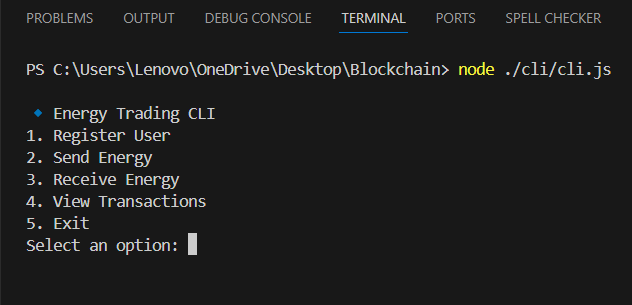

# Energy Trading Blockchain CLI



> A decentralized energy trading system built on Ethereum blockchain. This CLI-based application allows users to register, send, and receive energy, and view transaction history securely and transparently on the blockchain.

## What is Energy Trading?

Energy trading is the process of buying, selling, or exchanging energy (such as electricity) between producers, consumers, and sometimes intermediaries. In a decentralized system, individuals or organizations can trade surplus energy (for example, from solar panels) directly with others, often using smart contracts on a blockchain. This approach increases efficiency, transparency, and can help balance supply and demand in real time.

> **Note:**  
> This project is a futuristic, theoretical concept designed to demonstrate how decentralized energy trading could work using blockchain technology. While not yet implemented in the real world, it showcases how such a system could be built and potentially adopted in the future as energy markets evolve.

### Key Features

- [x] User Registration and Authentication
- [x] Send and Receive Energy
- [x] Transaction History on Blockchain
- [x] CLI-based User Interface
- [ ] Multi-user Support
- [ ] Real Money/Energy Integration

## 💻 Prerequisites

- Node.js (v14 or higher)
- Git
- Hardhat
- A local Ethereum node (Hardhat Network)
- Basic understanding of blockchain concepts

## 🚀 Installation

1. Clone the repository:
```bash
git clone https://github.com/rahul-jaiswar-git/Energy-Trading.git
cd Blockchain
```

2. Install dependencies:
```bash
npm install
```

3. Start the local blockchain:
```bash
npx hardhat node
```

4. Deploy the smart contract:
```bash
npx hardhat run scripts/deploy.js --network localhost
```

5. Run the CLI application:
```bash
node ./cli.js
```

## ☕ Usage

### CLI Menu
- Register User
- Send Energy
- Receive Energy
- View Transactions
- Exit

Follow the on-screen prompts to interact with the blockchain-based energy trading system.

## 🛠️ Technology Stack

- **CLI**: Node.js, readline-sync
- **Smart Contract**: Solidity (v0.8.28)
- **Blockchain**: Ethereum (Hardhat Network)
- **Development**: Hardhat

## 🏗️ File Structure

```
project/
├── contracts/                 # Smart Contracts
│   └── EnergyTrade.sol        # Main Energy Trading Contract
├── scripts/                   # Deployment Scripts
│   └── deploy.js              # Contract Deployment Script
├── test/                      # Test Files
├── cli.js                     # CLI Application (should be present)
├── hardhat.config.js          # Hardhat Configuration
├── package.json               # Project Dependencies
├── home-page.png              # CLI Screenshot
└── README.md                  # Project Documentation
```

## 🤝 Contributors

<table>
  <tr>
    <td align="center">
      <a href="https://github.com/rahul-jaiswar-git" title="Rahul Jaiswar">
        <br>
        <sub>
          <b>Rahul Jaiswar</b>
        </sub>
      </a>
    </td>
  </tr>
</table>

## 📝 License

This project is licensed under the MIT License - see the [LICENSE](LICENSE) file for details.
